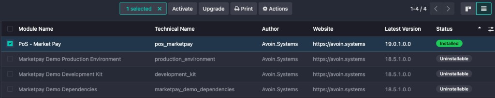
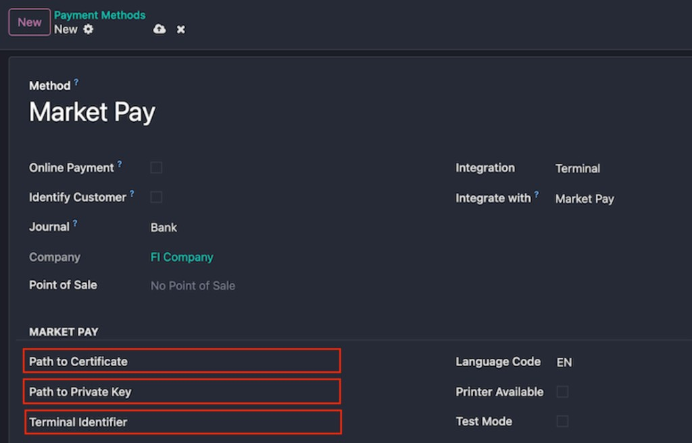

# PoS — Market Pay (`pos_marketpay`)

## Steps

### Step 1: Upload market pay certificate files to the server

Odoo should be able to read these files and you need to configure paths to the files in the Market Pay payment method.

### Step 2: Install module

- `pos_marketpay`

### Step 3: Configure Odoo

**Point of Sale / Configuration / Payment Methods**

Configure the payment method (for example **Market Pay**) with **Integration: Terminal** and **Integrate with: Market Pay**. Set **Path to Certificate**, **Path to Private Key**, and **Terminal Identifier** to valid server paths and values Odoo can use. Adjust **Language Code**, **Printer Available**, and **Test Mode** as needed.

### Step 4: Configure Terminal(s)

---

## Important Callback URL Requirement

Market Pay posts transaction updates back to your Odoo instance, so it is very important that Odoo’s `web.base.url` system parameter is set to a correct, publicly reachable URL (for example, no `localhost`).

For localhost testing, expose your Odoo instance to the internet so Market Pay can reach it, for example by using [ngrok](https://ngrok.com/).

---

## What must an Odoo partner do when they need to enable the Market Pay integration for their customer?

1. The Odoo partner contacts **Market Pay** via [https://market-pay.com/en/contact](https://market-pay.com/en/contact) to request the Market Pay module for Odoo (currently supported versions are **17** and **19**). Module access and distribution follow Market Pay’s process.

2. The Odoo partner adds the module to their **customer’s** repository.

3. Market Pay (or the end customer) sends the **certificate** file and the **key** file to the Odoo partner. The Odoo partner adds these to the server.

4. The Odoo partner configures the integration in the customer’s **test** environment as follows:

   1. Install the Market Pay module.

   2. Go to **PoS → Configuration → Settings** and select **Automatically validate order** (this setting must be enabled for the integration to work correctly).

   3. Go to **PoS → Configuration → Payment Methods** and create a new one.

   4. Fill in the following fields for the payment method:

      - **Name:** This can be, for example, Market Pay. *Note:* If multiple payment terminals are in use, a separate payment method must be created for each terminal. In that case, it may be good to include, for example, the last two digits of the terminal’s serial number in the payment method name so it is clear which terminal is selected when paying in PoS.

      - **Integration:** Select **Terminal** here.

      - **Integrate with:** **Market Pay**.

      - **Path to Certificate:** The location of the Market Pay certificate file on the server. The certificate is customer-specific and can be obtained from Market Pay. *Important:* Market Pay requires a CSR (Certificate Signing Request) to issue the certificate. More information: [Cloud API integration](https://assist.market-pay.com/hc/en-us/articles/41507382201361-Cloud-API-integration?brand_id=10480669413777#h_01K6WEBVHDZN9S83XMZ6B8XPF5).

      - **Path to Private Key:** The same as above but for the key file.

      - **Terminal Identifier:** The payment terminal’s serial number. *Important:* The terminal identifier should be prefixed with the manufacturer code, for example: `PAX:12345678`.

      - **Test Mode:** This is selected when testing.

      - **Store Code** (behind Debug Mode): By filling this in and pressing the **Refresh** button, you can see which payment terminals are linked to the respective customer-specific store code. The Store Code can be obtained from Market Pay.

---

For licensing, see the **LICENSE** file in this module.
